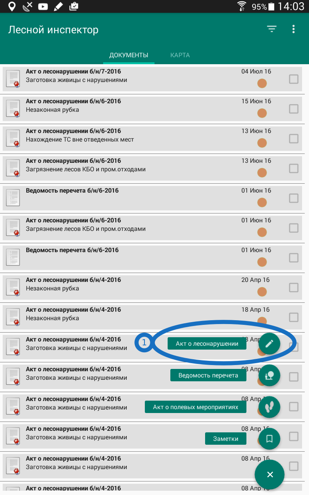

.. sectionauthor:: Дмитрий Барышников <dmitry.baryshnikov@nextgis.ru>

.. _ngfv_inspector:

Мобильное приложение "Лесной инспектор"
=======================================

Это - мобильное рабочее место лесного инспектора. Приложение обменивается картами, данными и документами с сервером. При прекращении доступа в интернет данные собираемые в приложении накапливаются, и затем отправляются при появлении сети. Документы создаваемые в этом приложении сохраняют в себе координаты.

Пользователь может делать следующие операции

* Создавать акт о лесонарушении. 
* Создавать отдельные ведомости пересчёта.
* Создавать акты полевых мероприятий.
* Создавать заметки.
* Смотреть карту.
* Просматривать созданные документы, выбирая их на карте.
* Просматривать точки целеуказаний.

.. figure:: _static/fw_start_screen.png
   :name: fw_start_screen
   :align: center
   :width: 6cm

   Главный экран программы, показываемый после запуска

   1 - верхняя панель. 2 - основная кнопка приложения.

Согласно требованиям разработчика операционной системы, во всех современных программах должна быть такая кнопка в углу окна. По нажатию на неё выполняется основное действие.

.. note:: Когда на экране карта - то идёт приём GPS. Когда карта убирается с экрана - приложение перестаёт слушать gps.

Создание акта о лесонарушени
-------------------------------------------------------

Этот документ состоит из набора текстовых полей, поля где задаётся геометрия, и у него могут быть акты

Ввод шапки акта о лесонарушении
^^^^^^^^^^^^^^^^^^^^^^^^^^^^^^^^^^^^^^^^^^^^^^^^^^^^^^^

1. На главном экране нажмите основную кнопку приложения. Нажмите "Акт о лесонарушении". Откроется форма акта.

   Кнопка создания акта о лесонарушении

.. figure:: _static/fw_akt_o_lesonarushenii_fristscreen.png
   :name: fw_akt_o_lesonarushenii_fristscreen
   :align: center
   :width: 10cm

   Форма акта о лесонарушении в начале заполнения

2. В поле :guilabel:`ФИО, должность и № удостоверения составителя акта` уже будет записано имя пользователя, на которого зарегистрировано приложение. 
3. В поле :guilabel:`Дата и время составления` будет указано текущее дата и время. Вы можете их поменять, нажав на кнопку справа от поля.
4. В поле :guilabel:`Место составления` введите название места составления акта.
5. В поле :guilabel:`1. Вид лесонарушения`  находится список. Нажмите на него, и выберите из списка нужный вид лесонарушения.
6. Нажмите на поле :guilabel:`2. Место совершения нарушения`. Откроется карта. Нажмите на основную кнопку.  

На карте геомерия выделяется розовым.

Указание места совершения нарушения
^^^^^^^^^^^^^^^^^^^^^^^^^^^^^^^^^^^^^^^^^^^^
Координаты можно задать разными способами по вашему выбору.

Список
""""""""""""""""""""""""""""""""""""""""""""

Откроется список лесных кварталов. Вы можете выбрать в нём одно или несколько значений. Нажмите на квадратик в правом краю, что бы поставить галочку. 

Список может быть очень длинным, поэтому по нему можно искать. Сверху имеется кнопка поиска (2). Нажмите на неё, введите на экранной клавиатуре часть названия (лесничество, или номер квартала), нажмите на клавиатуре кнопку поиска (на месте клавиши "ввод").

Охват по пням 
""""""""""""""""""""""""""""""""""""""""""""

Работает, только если уже введена ведомость пересчёта. Посмотреть позже.

Обходом
""""""""""""""""""""""""""""""""""""""""""""

Вылетает

Вручную
""""""""""""""""""""""""""""""""""""""""""""

На экране появится карта. Нажмите на кнопку, обозначенную на :numref:`fw_ngmobile_creating_mpolyg_pic` номером 2.

.. figure:: _static/toolbar_mpolyg.png
   :name: fw_ngmobile_toolbar_mpolyg_pic
   :align: center
   :width: 6cm
   
   Панель инструментов редактирования мультиполигона.
   
   Цифрами обозначено: 1 - завершение режима редактирования; 2 - добавить новый 
   мультиполигон; 3 - добавить полигон; 4 - ?; 5 - удалить мультиполигон; 6 - удалить 
   полигон; 7 - редактирование атрибутов.

На карте появится новая геометрия, мультиполигон, который будет создана в центре 
экрана. Одна из точек мультиполигона, которую можно перемещать по слою на карте, 
подсвечена красным светом, рядом с этой точкой будет отображена стрелка. Выделение 
любой точки мультиполигона позволяет ее перемещать по карте (см. :numref:`fw_ngmobile_creating_mpolyg_pic`).

.. figure:: _static/creating_mpolyg.png
   :name: fw_ngmobile_creating_mpolyg_pic
   :align: center
   :width: 6cm

   Этап создания мультиполигона.    

.. note:: Мультиполигон - значит что фигура может состоять из нескольких отдельных областей.

При необходимости можно добавить к геометрии другую область - Нажмите на кнопку, обозначенную на :numref:`fw_ngmobile_creating_mpolyg_pic` номером 3.

Кнопка 6 - удаляет выделенную точку. 

.. note:: Если экран узкий, и все кнопки на экране не поместятся, то они будут видны в меню, открываемом самой левой кнопкой на экране.

После рисования геометрии нажмите галочку в нижней панели (кнопку 1). На экране появится предложение ввести текст для территории.

   Предложение ввести текст для территории

Вы можете нажать кнопку Сохранить - тогда в акте будет записан текст, например: "Хорское лесничество Лазовское, часть 1 участковое лесничество квартал 275, квартал 274". Если вы хотите уточнить этот текст номерами выделов, то на экране карты нажмите пальцем на геометрию, нажмите галочку, в сообщении "Введите текст для территории" выберите "Набрать текст", и исправьте текст.

В результате появление нового мультиполигона на карте на нижней панели инструментов 
редактирования мультиполигона кнопка под цифрой 1 изменяет изображение с галочки 
на дискету, а также добавляется кнопка в виде крестика, "Отмена правок", находящаяся 
на нижней панели инструментов редактирования мультиполигона под цифрой 2 (см. :numref:`fw_ngmobile_toolbar_mpolyg1_pic`).

После ввода геометрии нажмите галочку на верхней панели экркна с картой, и вы вернётесь на экран акта.

Ввод полей посредине акта
^^^^^^^^^^^^^^^^^^^^^^^^^^^^^^^^^^^^^^^^^^^^

6. В поле :guilabel:`Категория защитности лесов`  находится список. Нажмите на него, и выберите из списка нужный элемент.

Заполните поля 3. Когда и кем обнаружено лесонарушение, 4. Когда совершено лесонарушение, 5. Предполагаемое лицо, совершившее лесонарушение.

Заполните поля 7, 8, 9 и Примечание

Нажмите кнопку Заполнить ведомость перечета

Ведомость перечета
^^^^^^^^^^^^^^^^^^^^^^^^^

На экране ведомости перечета нажмите главную кнопку. Откроется окно добавления данных

Окно добавления данных в ведомость перечета

Введите данные в шапке формы: номер выдела, категорию хлыстов и разряд высот.
Затем, отметьте пни, нажимая кнопки + в таблице. По таблице можно перемещаться вправо-влево и вверх-вниз, нажимая и сдвигая её пальцем.

.. note:: когда ставится плюсик - записываютяс координаты. потом их можно использовать для охвата по пням. при этом нуэно проверять в верхней панели что бы координаты определились. если не определились - нажмите обновить
.. note:: названия видов и диаметры пней берутся из справочников, ссылка на страницу админиситрирование.

После завершения ввода нажмите галочку сверху формы.

На экране ведомости пересчёта теперь появися список (см. :numref:`fw_pereschet_data`).

.. figure:: _static/fw_pereschet_data.png
   :name: fw_pereschet_data
   :align: center
   :width: 6cm

   Окно ведомости пересчёта с введёнными данными

Для удаления записей из ведомости пересчёта нажмите на квадрат в правой части строки. Когда он выделится галочкой, то сверху экрана появится иконка ведра. По её нажатию удалятся отмеченные галочкой записи.
Для редактирования записей в ведомости пересчёта нажмите на текст записи. Откроется окно, где вы сможете менять все атрибуты.

После завершения ввода ведомости пересчёта нажмите кнопку <-- в верхней панели.

Вид и количество продукции подлежащей изятию
^^^^^^^^^^^^^^^^^^^^^^^^^^^^^^^^^^^^^^^^^^^^^^^^^^^^^
На экране Продукция для изъятия нажмите главную кнопку. Откроется окно добавления данных (см. :numref:`fw_produkcia_dlya_izatia_entering`).

.. figure:: _static/fw_produkcia_dlya_izatia_entering.png
   :name: fw_produkcia_dlya_izatia_entering
   :align: center
   :width: 6cm

   Окно добавления данных о продукции для изъятия

После завершения ввода нажмите кнопку Добавить.

На экране продукции для изъятия теперь появися список (см. :numref:`fw_produkcia_dlya_izatia_data`).

.. figure:: _static/fw_produkcia_dlya_izatia_data.png
   :name: fw_produkcia_dlya_izatia_data
   :align: center
   :width: 6cm

   Окно продукции для изъятия с введёнными данными

Для удаления записей из списка нажмите на квадрат в правой части строки. Когда он выделится галочкой, то сверху экрана появится иконка ведра. По её нажатию удалятся отмеченные галочкой записи.

Для редактирования записей в списке нажмите на текст записи. Откроется окно, где вы сможете менять все атрибуты.

После завершения ввода списка пересчёта нажмите кнопку <-- в верхней панели.

.. note:: нажимайте кнопку сохранить, что бы не пропало

Акт об обнаружении орудий заготовки
^^^^^^^^^^^^^^^^^^^^^^^^^^^^^^^^^^^^^^^^^^^^^^^^^^^^^

На экране Акт об обнаружении орудий заготовки нажмите главную кнопку. Откроется окно добавления данных (см. :numref:`fw_akt_obnaruzenia_orudiy_entering`).

.. figure:: _static/fw_akt_obnaruzenia_orudiy_entering.png
   :name: fw_akt_obnaruzenia_orudiy_entering
   :align: center
   :width: 6cm

   Окно добавления данных о продукции для изъятия

После завершения ввода нажмите кнопку Добавить.

На экране продукции для изъятия теперь появися список (см. :numref:`fw_akt_obnaruzenia_orudiy_data`).

.. figure:: _static/fw_akt_obnaruzenia_orudiy_data.png
   :name: fw_akt_obnaruzenia_orudiy_data
   :align: center
   :width: 6cm

   Окно продукции для изъятия с введёнными данными

Для удаления записей из списка нажмите на квадрат в правой части строки. Когда он выделится галочкой, то сверху экрана появится иконка ведра. По её нажатию удалятся отмеченные галочкой записи.

Для редактирования записей в списке нажмите на текст записи. Откроется окно, где вы сможете менять все атрибуты.

После завершения ввода списка пересчёта нажмите кнопку <-- в верхней панели.

Фототаблица
^^^^^^^^^^^^^^^^^^^^^^^^^^^^^^^^^^^^^^^^^^^^^^^^^^^^^

На экране фототаблицы нажмите главную кнопку. Запустится системное приложение фотокамеры устройства. Интерфейс их отличается у разных марок устройств, но в любом случае для съёмки нужно нажать самую большую кнопку на панели. 

.. note:: Перед съёмкой протрите объектив тканью.

Для удаления фотографий нажмите и подержите на прямоугольную отметку на фотографии. Отмеченные фото можно удалить нажатием кнопки ведро.

После завершения добавления фотографий нажмите кнопку <-- в верхней панели.
 

Сохранение
^^^^^^^^^^^^^^^^^^^^^^^^^^^^^^^^^^

По нажатию на кнопку Сохранить 
По нажатию на кнопку Подписать и отправить откроется окно (см. :numref:`fw_akt_lesonarushenie_sign_send`). В нём надо пальцем или стилусом поставить свою подпись. Затем нажмите на кнопку Сохранить. После нажатия этой кнопки акт сохранится, и исправлять его будет нельзя.

.. figure:: _static/fw_akt_obnaruzenia_orudiy_data.png
   :name: fw_akt_obnaruzenia_orudiy_data
   :align: center
   :width: 6cm

   Окно где надо вводить подпись для отправки акта.
    

Создание акта полевых мероприятий
-------------------------------------------------

* На главном экране нажмите основную кнопку приложения. Нажмите "Акт о полевых мероприятиях".

Создание заметки
------------------------------

Для создания заметки выполните эти действия:

* На главном экране нажмите основную кнопку приложения. Нажмите "Заметки".

Пункт создания заметки в основной кнопке приложения.

Сверху экрана вы видите панель координат

Ввод координат 
^^^^^^^^^^^^^^^^^^^^^^^^^^^^^^^^^

Задание координат работает одинаково для всех форм.
По нажатию клавиши [круглое] в форме будут записаны текущие координаты.
По нажатию клавиши [маркер] откроется карта. В середине карты будет маркер [маркер]. Передвиньте его пальцем на нужное место, и нажмите [галочка]

Настройки, которые должны быть выставлены для работы
----------------------------------------------------------

* В устройстве должен быть включён gps
* В приложении должно быть включено брать координаты с gpx
* В приложении должна быть включена синхронизация
