.. sectionauthor:: Дмитрий Барышников <dmitry.baryshnikov@nextgis.ru>

.. _ngfv_inspector:

Мобильное приложение "Лесной инспектор"
=======================================

Это - мобильное рабочее место лесного инспектора. Приложение обменивается картами, данными и документами с сервером. При прекращении доступа в интернет данные, собираемые в приложении, накапливаются и затем отправляются при появлении сети. Документы, создаваемые в этом приложении, сохраняют в себе координаты.

Пользователь может делать следующие операции в данном мобильном приложении:

1. Создавать акт о лесонарушении. 
2. Создавать отдельные ведомости пересчёта.
3. Создавать акты полевых мероприятий.
4. Создавать заметки.
5. Смотреть карту.
6. Просматривать созданные документы, выбирая их на карте.
7. Просматривать точки целеуказаний.

Настройки, которые должны быть выставлены для работы:
----------------------------------------------------------

1. В устройстве должен быть включён gps.
2. В настройках должно быть включено брать координаты с gps.
3. В приложении должна быть включена синхронизация.

Интерфейс
-------------------------

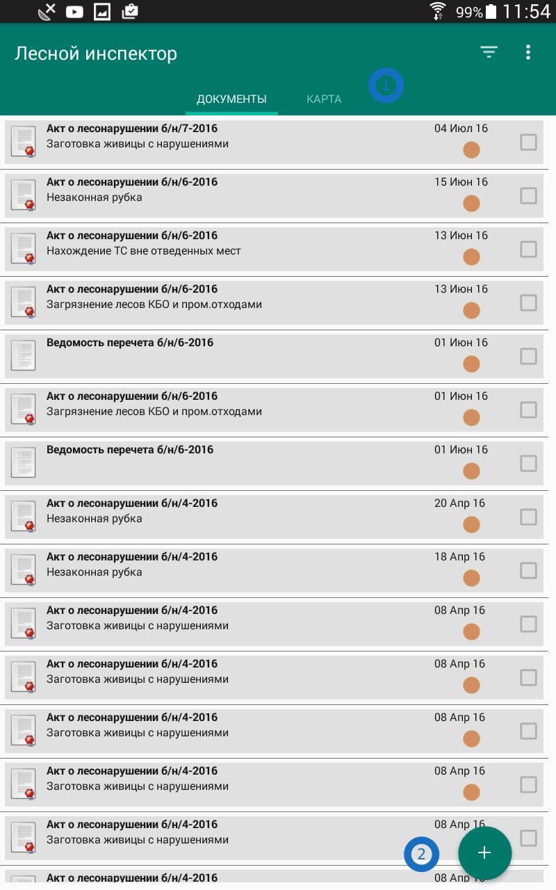

   Главный экран программы, показываемый после запуска.

   1 - верхняя панель. 2 - основная кнопка приложения.

Цифрой 2 на рис. :numref:`fw_start_screen` обозначена главная кнопка приложения - она часто будет упоминаться в документации.
В верхней панели можно переключатся между списком документов и картой, на которой видна геометрия, записанная в документах.

.. note:: Когда на экране карта - то идёт приём GPS. Когда карта убирается с экрана - приложение перестаёт слушать GPS.

Создание акта о лесонарушени
-------------------------------------------------------

Этот документ состоит из набора текстовых полей, поля, где задаётся геометрия, и у него могут быть акты. Для заполнения формы выполните последовательность действий, описаную в этом разделе.

Ввод шапки акта о лесонарушении
^^^^^^^^^^^^^^^^^^^^^^^^^^^^^^^^^^^^^^^^^^^^^^^^^^^^^^^

1. На главном экране нажмите основную кнопку приложения. Нажмите "Акт о лесонарушении". 
Откроется форма акта.

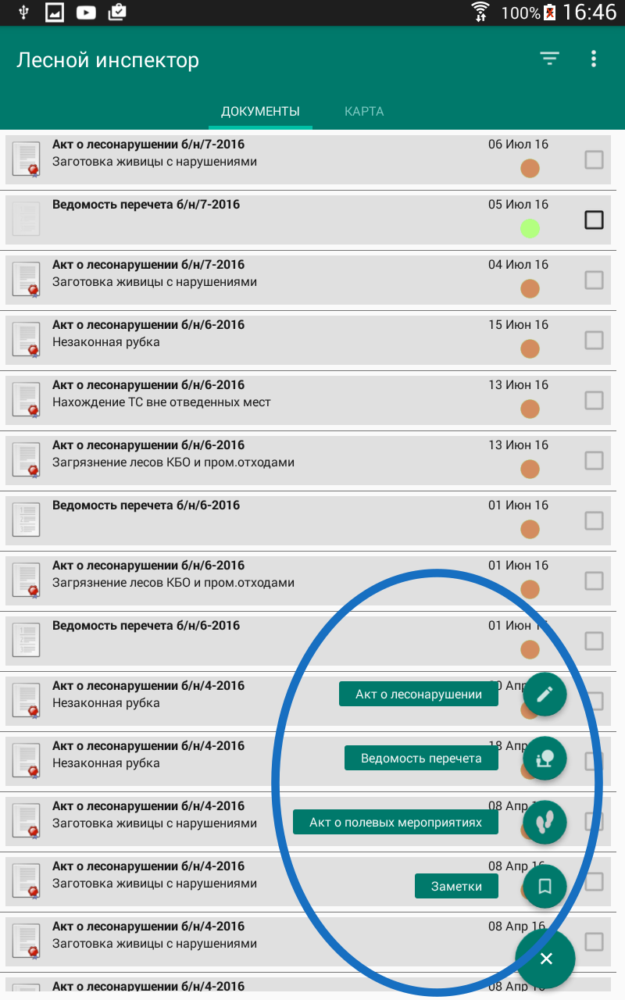

   Кнопка создания акта о лесонарушении.

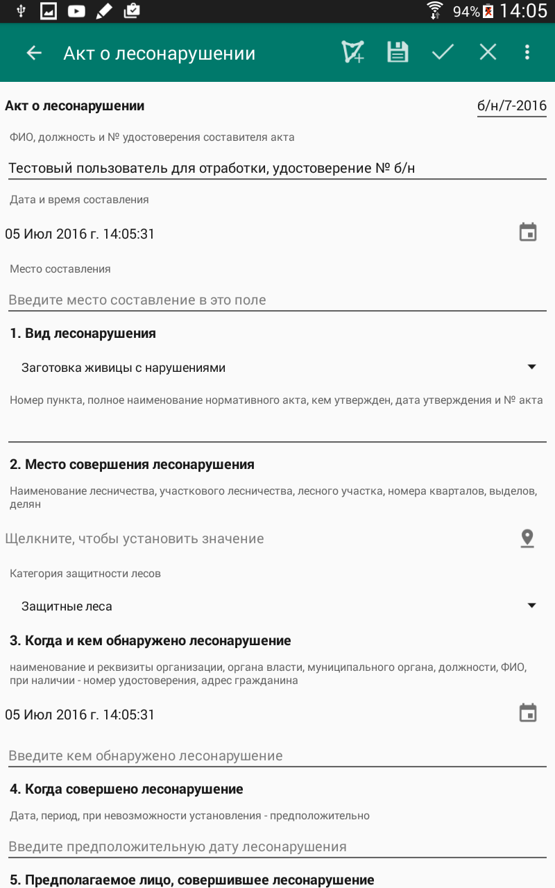

   Форма акта о лесонарушении в начале заполнения.

2. В поле :guilabel:`ФИО, должность и № удостоверения составителя акта` уже будет записано имя пользователя, на которого зарегистрировано приложение. 
3. В поле :guilabel:`Дата и время составления` будет указано текущее дата и время. Вы можете их поменять, нажав на кнопку справа от поля.

.. note::  Во время составления вы можете нажать кнопку :guilabel:`Сохранить`, которая находится внизу формы. Форма акта закроется, программа перейдёт на главный экран, в списке документов ваш акт будет самым верхним. Акт сохранится в памяти устройства, и при необходимости вы сможете его выключать, заменять батарею, и т.п. Акт можно будет открыть из списка и продолжить его заполнение.

Указание места совершения нарушения
^^^^^^^^^^^^^^^^^^^^^^^^^^^^^^^^^^^^^^^^^^^^
На этом этапе нужно составить текст с описанием места совершения нарушения. Для этого 
нужно задать геометрию места нарушения на карте, и на основании заданной геометрии
сгенерируется текст. 

4. Нажмите на поле :guilabel:`2. Место совершения нарушения`. Откроется карта. Нажмите 
на основную кнопку. 

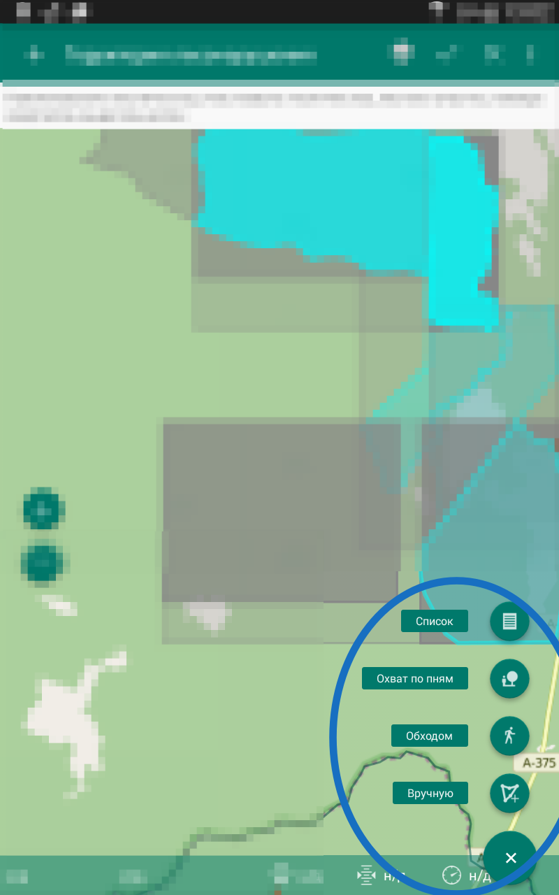

   Варианты задания координат.

Координаты можно задать разными способами по вашему выбору (см. :numref:`fw_modes_add_coordinates`).

Список 
""""""""""""""""""""""""""""""""""""""""""""

Откроется список лесоделения. Вы можете выбрать в нём одно или несколько значений. Нажмите на квадратик в правом краю, чтобы поставить галочку (см. :numref:`fw_spisok_lesodelenie`). 

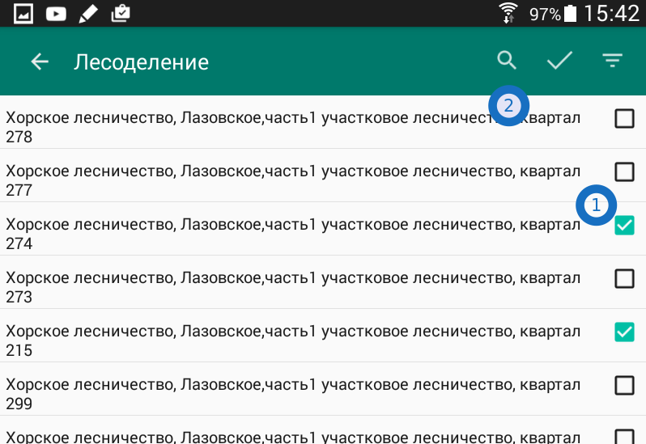

   Список лесоделения с двумя выделеными кварталами.

Список может быть очень длинным, поэтому по нему организовать поиск. Сверху на :numref:`fw_spisok_lesodelenie` имеется кнопка поиска (2). Нажмите на неё, введите с помощью экранной клавиатуры часть искомого названия (лесничество или номер квартала), нажмите на клавиатуре кнопку поиска (на месте клавиши :guilabel:`ввод`, см. :numref:`fw_spisok_lesodelenie_search` ).

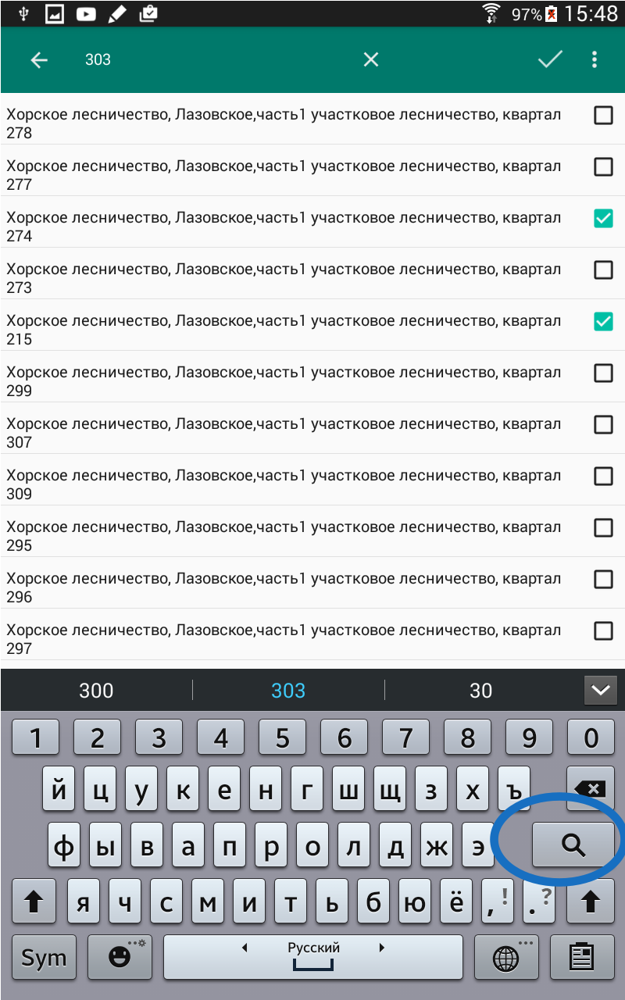

   Поиск по списку лесоделения.

Охват по пням 
""""""""""""""""""""""""""""""""""""""""""""

Эта опция работает, если только к данному акту о лесонарушении уже введена ведомость 
пересчёта. В таком случае вы можете нажать кнопку Охват по пням, и охват возьмётся по пням. 
Но для этого необходимо, чтобы в ведомости пересчёта было несколько разных координат.

Обходом
""""""""""""""""""""""""""""""""""""""""""""

После нажатия кнопки :guilabel:`Обходом` вы можете обойти пешком или объехать на 
транспортном средстве территорию. 

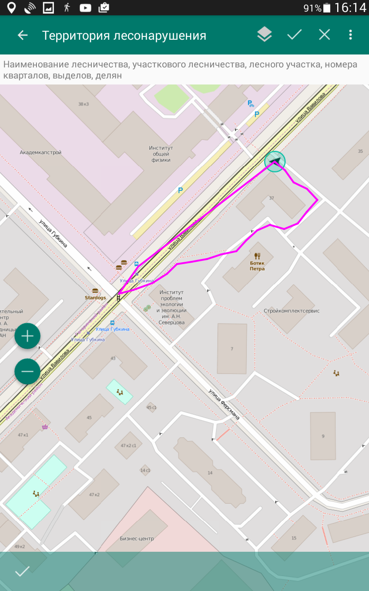

   Экран в процессе ввода полигона обходом.

В процессе обхода на карте будет рисоваться замкнутая фигура, поэтому нет необходимости 
завершать обход именно в точке старта. Когда вы завершите обход, нажмите на галочку. 
Карта перейдёт в режим редактирования геометрии, вы сможете добавить или убрать часть линии(см. :numref:`fw_vvod_obkhodom_2`).

.. figure:: _static/fw_vvod_obkhodom_2.png
   :name: fw_vvod_obkhodom_2
   :align: center
   :width: 10cm

   Экран в процессе редактирования геометрии после ввода обходом.

Например, в начале обхода из-за помех GPS точка переместилась на другую сторону дороги. 
Можно нажать на эту точку, и на нижней панели нажать кнопку :guilabel:`Удалить точку`.
После завершения редактирования нажмите на галочку.

Вручную
""""""""""""""""""""""""""""""""""""""""""""

На экране появится карта. Нажмите на кнопку, обозначенную на :numref:`fw_ngmobile_creating_mpolyg_pic` номером 2.

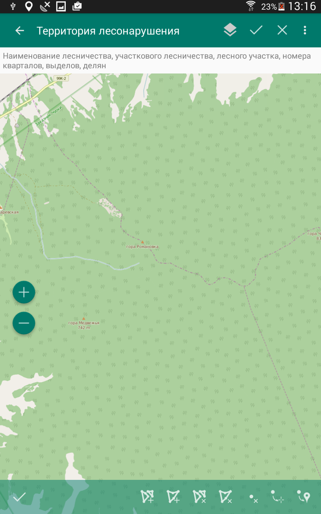

   
   Панель инструментов редактирования мультиполигона. 
   
   Цифрами обозначено: 1 - завершение режима редактирования; 2 - добавить новый 
   мультиполигон; 3 - добавить полигон; 4 - удалить мультиполигон; 5 - удалить часть 
   мультиполигона; 6 - удалить выделенную точку; 7 - переместить выделенную точку в 
   центр экрана; 7 - переместить выделенную точку в текущие координаты.

На карте появится новая геометрия, мультиполигон, который будет создана в центре 
экрана. Одна из точек мультиполигона, которую можно перемещать по слою на карте, 
подсвечена красным светом, рядом с этой точкой будет отображена стрелка. Выделение 
любой точки мультиполигона позволяет ее перемещать по карте (см. :numref:`fw_ngmobile_creating_mpolyg_pic`).

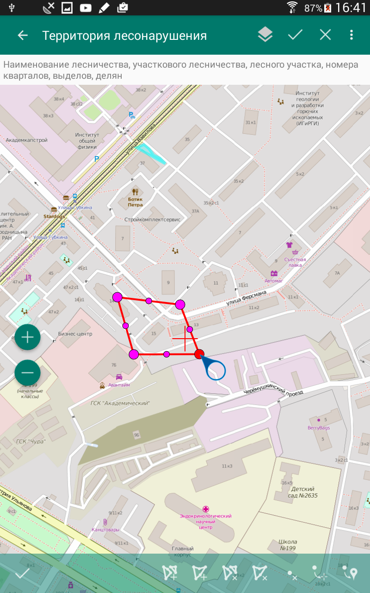

   Этап создания мультиполигона.    

.. note:: Мультиполигон - значит что фигура может состоять из нескольких отдельных областей.

При необходимости можно добавить к геометрии другую область - Нажмите на кнопку, обозначенную на :numref:`fw_ngmobile_creating_mpolyg_pic` номером 3.

Кнопка 6 - удаляет выделенную точку. 

.. note:: Если экран узкий, и все кнопки на экране не поместятся, то они будут видны в меню, открываемом самой левой кнопкой на экране.

После рисования геометрии нажмите галочку в нижней панели (кнопку 1). На экране 
появится предложение ввести текст для территории (см. :numref:`fw_text_for_videl`).

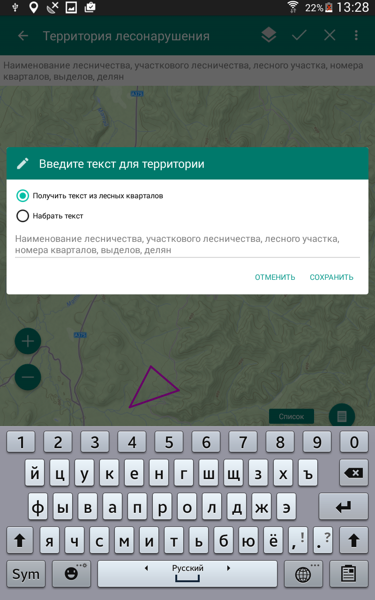

   Предложение ввести текст для территории.

Вы можете нажать кнопку :guilabel:`Сохранить` - тогда в акте будет записан текст, например: "Хорское лесничество Лазовское, часть 1 участковое лесничество квартал 275, квартал 274". Если вы хотите уточнить этот текст номерами выделов, то на экране карты нажмите пальцем на геометрию, нажмите галочку, в сообщении :guilabel:`Введите текст для территории` выберите :guilabel:`Набрать текст`, и исправьте текст.

В результате появление нового мультиполигона на карте на нижней панели инструментов 
редактирования мультиполигона кнопка под цифрой 1 изменяет изображение с галочки 
на дискету, а также добавляется кнопка в виде крестика, :guilabel:`Отмена правок`, находящаяся 
на нижней панели инструментов редактирования мультиполигона под цифрой 2 (см. :numref:`fw_ngmobile_creating_mpolyg_pic`).

.. note:: На карте геометрия выделяется розовым цветом.

После ввода геометрии нажмите галочку на верхней панели экрана с картой, и вы вернётесь на экран акта.

Ввод полей посредине акта
^^^^^^^^^^^^^^^^^^^^^^^^^^^^^^^^^^^^^^^^^^^^

Возвращаемся на экран заполнения акта о лесонарушении.

5. В поле :guilabel:`1. Вид лесонарушения`  находится список. Нажмите на него и выберите 
из списка нужный вид лесонарушения.
6. В поле :guilabel:`Категория защитности лесов` находится список. Нажмите на него и выберите 
из списка нужный элемент.
7. Заполните поля :guilabel:`3. Когда и кем обнаружено лесонарушение`, :guilabel:`4. Когда совершено лесонарушение`, :guilabel:`5. Предполагаемое лицо, совершившее лесонарушение`.
8. Заполните поля 7, 8, 9 и :guilabel:`Примечание`.
9. При необходимости вы можете заполнить ведомость перечета, ведомость продукции для изъятия, акт об обнаружении орудий незаконной заготовки, фототаблицу, нажав соответствующие кнопки. Эти ведомости не являются обязательными. Инструкции по их заполнению приведены ниже.

После того как вы всё внесли в форму акта, нажмите на кнопку :guilabel:`Подписать и отправить`. Откроется окно (см. :numref:`fw_akt_o_lesonarushenii_save_signature`). В нём надо пальцем 
или стилусом поставить свою подпись. Затем нажмите на кнопку guilabel:`Сохранить`. После нажатия 
этой кнопки акт сохранится, и исправлять его будет нельзя.

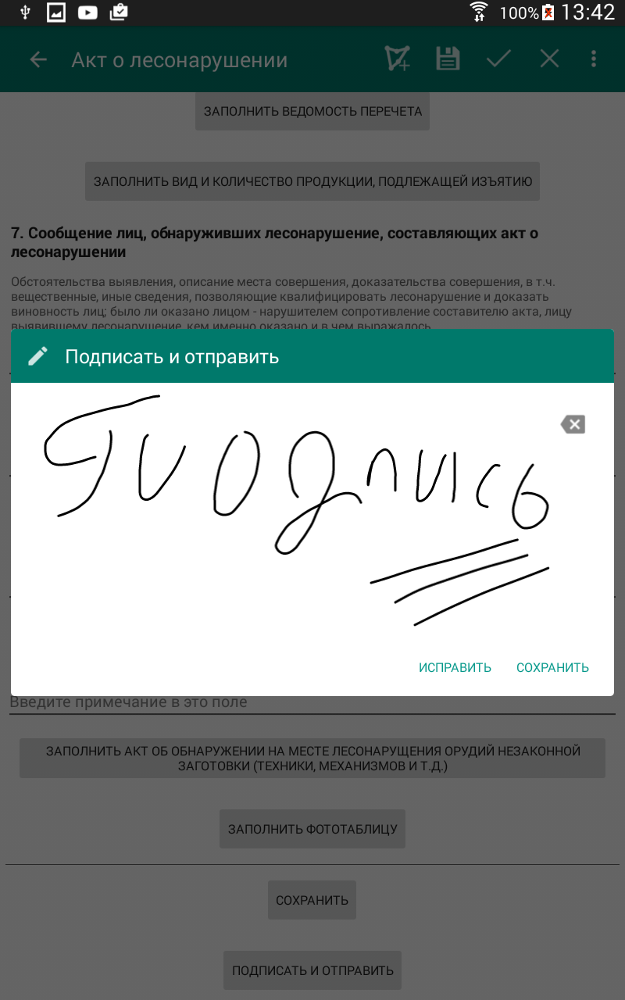

   Окно для введение подписи перед отправкой акта.
    

Ведомость перечета
^^^^^^^^^^^^^^^^^^^^^^^^^

На экране ведомости перечета нажмите главную кнопку. Откроется окно добавления данных.

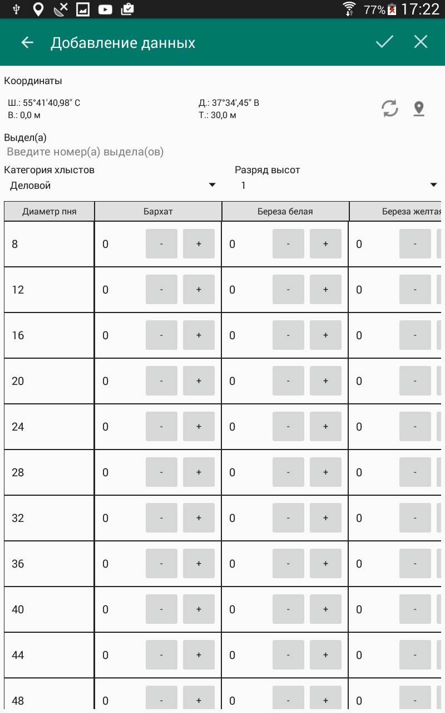

   Окно добавления данных в ведомость перечета.

Введите данные в шапке формы: номер выдела, категорию хлыстов и разряд высот.
Затем, отметьте пни, нажимая кнопки + в таблице. По таблице можно перемещаться вправо-влево 
и вверх-вниз, нажимая и сдвигая её пальцем.

.. note:: Это примечание нужно только для того, что бы разобраться в алгоритме работы приложения на случай необходимости доработок. Хотя координаты в ведомости перечета не используются в этой системе, но приложение всё равно их записывает. При открытии  Окно добавления данных в ведомость перечета считываются координаты, и записываются сверху. Автоматически они не обновляются. Их можно обновить при нажатии кнопки "Обновить". Когда  Окно добавления данных в ведомость перечета закрывается, то ко всем добавленным записям записываются последние координаты. Если  Окно добавления данных в ведомость перечета открыть второй раз, то у пней собранных в нём будут записаны другие координаты.

.. note:: названия видов и диаметры пней берутся из справочников, которые хранятся и задаются в веб-компоненте системы.  
.. todo:: ссылку на администрирование.

После завершения ввода нажмите галочку сверху формы.

На экране ведомости пересчёта теперь появится список (см. :numref:`fw_pereschet_data`).

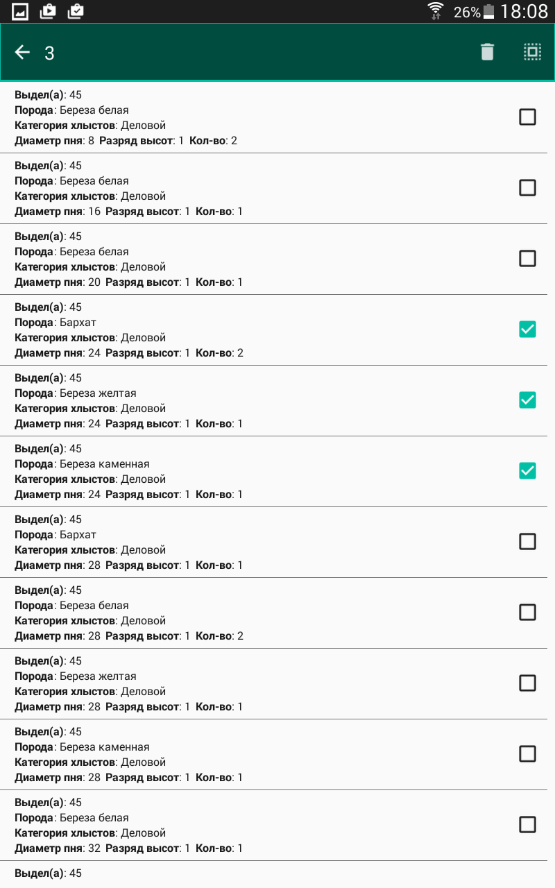

   Окно ведомости пересчёта с введёнными данными

Для удаления записей из ведомости перечета нажмите на квадрат в правой части строки. Когда он выделится галочкой, то сверху экрана появится иконка ведра. По её нажатию удалятся отмеченные галочкой записи.
Для редактирования записей в ведомости пересчёта нажмите на текст записи. Откроется окно, где вы сможете менять все атрибуты.

После завершения ввода ведомости перечёта нажмите кнопку <-- в верхней панели.

Вид и количество продукции подлежащей изятию
^^^^^^^^^^^^^^^^^^^^^^^^^^^^^^^^^^^^^^^^^^^^^^^^^^^^^
На экране Продукция для изъятия нажмите главную кнопку. Откроется окно добавления данных (см. :numref:`fw_produkcia_dlya_izatia_entering`).

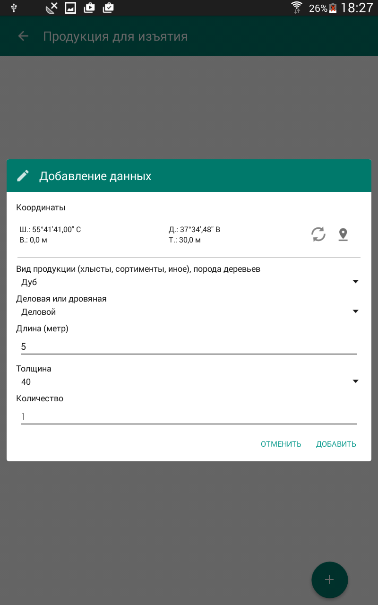

   Окно добавления данных о продукции для изъятия

После завершения ввода нажмите кнопку :guilabel:`Добавить`.

На экране продукции для изъятия теперь появися список (см. :numref:`fw_produkcia_dlya_izatia_data`).

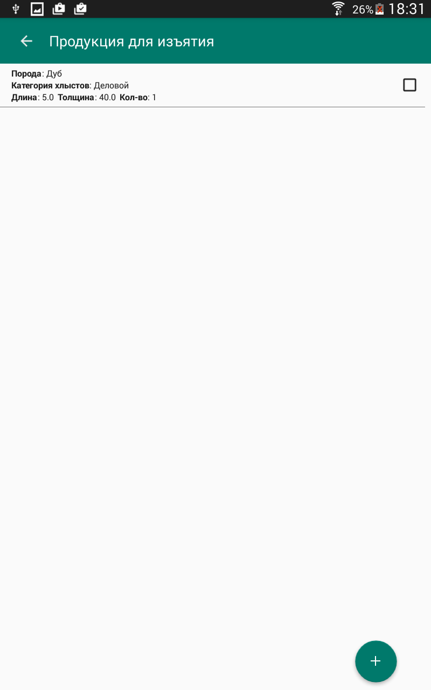

   Окно продукции для изъятия с введёнными данными

Для удаления записей из списка нажмите на квадрат в правой части строки. Когда он выделится галочкой, то сверху экрана появится иконка ведра. По её нажатию удалятся отмеченные галочкой записи.

Для редактирования записей в списке нажмите на текст записи. Откроется окно, где вы сможете менять все атрибуты.

После завершения ввода списка пересчёта нажмите кнопку <-- в верхней панели.

Акт об обнаружении орудий заготовки
^^^^^^^^^^^^^^^^^^^^^^^^^^^^^^^^^^^^^^^^^^^^^^^^^^^^^

На экране :guilabel:`Акт об обнаружении орудий` заготовки нажмите главную кнопку. Откроется окно добавления данных (см. :numref:`fw_akt_obnaruzenia_orudiy_entering`).

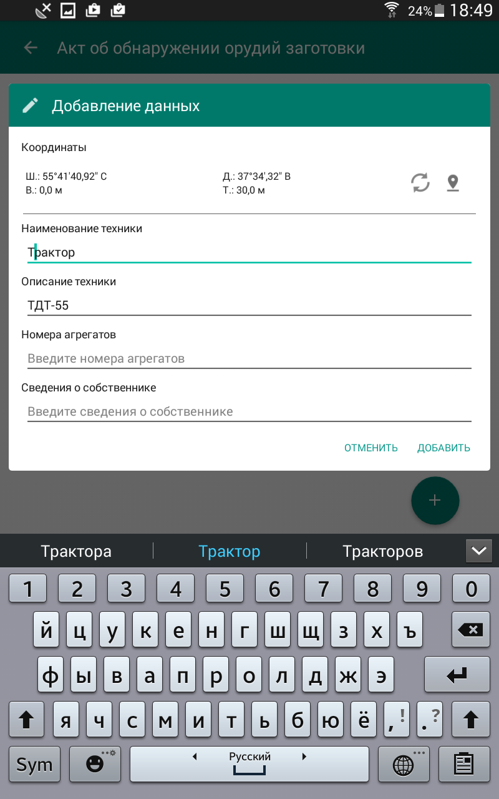

   Окно добавления данных о продукции для изъятия

После завершения ввода нажмите кнопку :guilabel:`Добавить`.

На экране продукции для изъятия теперь появися список (см. :numref:`fw_akt_obnaruzenia_orudiy_data`).

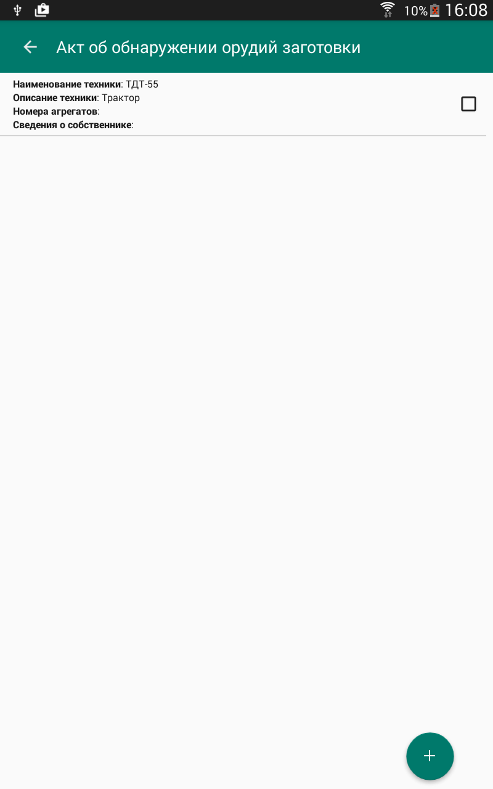

   Окно продукции для изъятия с введёнными данными

Для удаления записей из списка нажмите на квадрат в правой части строки. Когда он выделится галочкой, то сверху экрана появится иконка ведра. По её нажатию удалятся отмеченные галочкой записи.

Для редактирования записей в списке нажмите на текст записи. Откроется окно, где вы сможете менять все атрибуты.

После завершения ввода списка пересчёта нажмите кнопку <-- в верхней панели.

Фототаблица
^^^^^^^^^^^^^^^^^^^^^^^^^^^^^^^^^^^^^^^^^^^^^^^^^^^^^

На экране фототаблицы нажмите главную кнопку. Запустится системное приложение фотокамеры устройства. Интерфейс их отличается у разных марок устройств, но в любом случае для съёмки нужно нажать самую большую кнопку на панели. 

.. note:: Перед съёмкой протрите объектив тканью.

Для удаления фотографий нажмите и подержите на прямоугольную отметку на фотографии. Отмеченные фото можно удалить нажатием кнопки ведро.

После завершения добавления фотографий нажмите кнопку <-- в верхней панели.
 

Создание отдельной ведомости перечёта
------------------------------

Имеется возможность создать отдельную ведомость пересчёта деревьев. Её можно подписать и отправить на сервер.

Для создания ведомости пересчёта деревьев, выйдтие на главный экран приложения, нажмите на главную кнопку приложения, нажмите пункт "Ведомость перечёта".

На экране ведомости перечета нажмите главную кнопку. Откроется окно добавления данных

   Окно добавления данных в ведомость перечета

Введите данные в шапке формы: номер выдела, категорию хлыстов и разряд высот.
Затем, отметьте пни, нажимая кнопки + в таблице. По таблице можно перемещаться вправо-влево и вверх-вниз, нажимая и сдвигая её пальцем.

.. note:: названия видов и диаметры пней берутся из справочников, которые хранятся и задаются в веб-компоненте системы.  
.. todo:: ссылку на администрирование.

После завершения ввода нажмите галочку сверху формы.

На экране ведомости пересчёта теперь появится список (см. :numref:`fw_pereschet_standalone_data`).

   Окно ведомости пересчёта с введёнными данными

Для удаления записей из ведомости перечета нажмите на квадрат в правой части строки. Когда он выделится галочкой, то сверху экрана появится иконка ведра. По её нажатию удалятся отмеченные галочкой записи.
Для редактирования записей в ведомости пересчёта нажмите на текст записи. Откроется окно, где вы сможете менять все атрибуты.

После завершения ввода ведомости перечёта нажмите кнопку <-- в верхней панели.

Создание акта полевых мероприятий
-------------------------------------------------

* На главном экране нажмите основную кнопку приложения. Нажмите :guilabel:`Акт о полевых мероприятиях`.

Этот документ состоит из набора текстовых полей. Для заполнения формы выполните последовательность действий, описаную в этом разделе.

Заполнение акта
^^^^^^^^^^^^^^^^^^^^^^^^^^^^^^^^^^^^^^^^^^^^^^^^^^^^^^^

1. На главном экране нажмите основную кнопку приложения. Нажмите "Акт о лесонарушении". Откроется форма акта.

   Кнопка создания акта полевых мероприятий находится тут

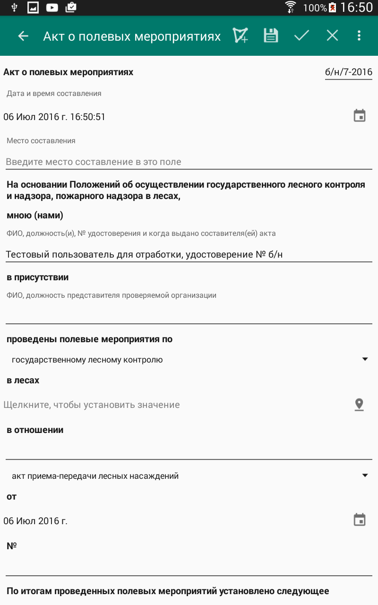

   Форма акта полевых мероприятий в начале заполнения

.. note::  Во время составления вы можете нажать кнопку Сохранить, которая находится в низу формы. Форма акта закроется, программа перейдёт на главный экран, в списке документов ваш акт будут самым верхним. Акт сохранится в памяти устройства, и при необходимости вы сможете его выключать, заменять батарею, и т.п. В списке этот акт можно будет открыть, и продолжить его заполнение.

2. В поле :guilabel:`Дата и время составления` будет указано текущее дата и время. Вы можете их поменять, нажав на кнопку справа от поля.
3. В поле :guilabel:`Место составления` введите название места составления акта.
4. В поле :guilabel:`ФИО, должность и № удостоверения составителя акта` уже будет записано имя пользователя, на которого зарегистрировано приложение. 
5. Заполните поле :guilabel:`В присутствии`.
6. В поле :guilabel:`Проведены полевые мероприятия по` находится список. Нажмите на него, и выберите из списка подходящий вариант.
7. Заполните остальные поля.
8. В поле :guilabel:`В лесах` вводится геометрия. Нажмите на это поле, и на экране откроется карта.
 
Указание места для акта полевых мероприятий
^^^^^^^^^^^^^^^^^^^^^^^^^^^^^^^^^^^^^^^^^^^^
На этом этапе нужно составить текст с описанием места совершения нарушения. Для этого нужно задать геометрию места нарушения на карте, и по этой фигуре сгенерируется текст. 

9. Нажмите на поле :guilabel:`2. Место совершения нарушения`. Откроется карта. Нажмите на основную кнопку.  

Координаты можно задать разными способами по вашему выбору.

Список 
""""""""""""""""""""""""""""""""""""""""""""

Откроется список лесоделения. Вы можете выбрать в нём одно или несколько значений. Нажмите на квадратик в правом краю, что бы поставить галочку. 

   Список лесоделения с двумя выделеными кварталами

Список может быть очень длинным, поэтому по нему можно искать. Сверху на :numref:`fw_spisok_lesodelenie_search_akt_polevykh_meropriatii` имеется кнопка поиска (2). Нажмите на неё, введите на экранной клавиатуре часть названия (лесничество, или номер квартала), нажмите на клавиатуре кнопку поиска (на месте клавиши "ввод").

   Поиск по списку лесоделения

Охват по пням 
""""""""""""""""""""""""""""""""""""""""""""

Работает, только если к данному акту о лесонарушении уже введена ведомость пересчёта. В таком случае вы можете нажать кнопку Охват по пням, и охват возьмётся по пням. Но для этого необходимо, что бы в ведомости пересчёта было несколько разных координат.

Обходом
""""""""""""""""""""""""""""""""""""""""""""

После нажатия кнопки Обходом вы можете обойти пешком или объехать на транспортном средстве территорию. 

   Экран в процессе ввода полигона обходом.

В процессе обхода на карте будет рисоваться замкнутая фигура, поэтому нет необходимости завершать обход именно в точке старта. Когда вы завершите обход - нажмите на галочку. Карта перейдёт в режим редактирования геометрии, вы сможете добавить или убрать часть линии(см. :numref:`fw_vvod_obkhodom_2_akt_polevykh_meropriatii`).

.. figure:: _static/fw_vvod_obkhodom_2.png
   :name: fw_vvod_obkhodom_2_akt_polevykh_meropriatii
   :align: center
   :width: 10cm

   Экран в процессе редактирования геометрии после ввода обходом.

Например, в начале обхода, из-за помех GPS точка переместилась на другую сторону дороги. Можно нажать на эту точку, и на нижней панели нажать кнопку "Удалить точку".

После завершения редактирования нажмите на галочку.

Вручную
""""""""""""""""""""""""""""""""""""""""""""

На экране появится карта. Нажмите на кнопку, обозначенную на :numref:`fw_ngmobile_creating_mpolyg_pic_2` номером 2.

   
   Панель инструментов редактирования мультиполигона. 
   
   Цифрами обозначено: 1 - завершение режима редактирования; 2 - добавить новый 
   мультиполигон; 3 - добавить полигон; 4 - удалить мультиполигон; 5 - удалить часть мультиполигона; 6 - удалить 
   выделенную точку; 7 - переместить выделенную точку в центр экрана; 7 - переместить выделенную точку в текущие координаты.

На карте появится новая геометрия, мультиполигон, который будет создана в центре 
экрана. Одна из точек мультиполигона, которую можно перемещать по слою на карте, 
подсвечена красным светом, рядом с этой точкой будет отображена стрелка. Выделение 
любой точки мультиполигона позволяет ее перемещать по карте (см. :numref:`fw_ngmobile_creating_mpolyg_pic_2`).

   Этап создания мультиполигона.    

.. note:: Мультиполигон - значит что фигура может состоять из нескольких отдельных областей.

При необходимости можно добавить к геометрии другую область - Нажмите на кнопку, обозначенную на :numref:`fw_ngmobile_creating_mpolyg_pic_2` номером 3.

Кнопка 6 - удаляет выделенную точку. 

.. note:: Если экран узкий, и все кнопки на экране не поместятся, то они будут видны в меню, открываемом самой левой кнопкой на экране.

После рисования геометрии нажмите галочку в нижней панели (кнопку 1). На экране появится предложение ввести текст для территории (см. :numref:`fw_text_for_videl_2`).

   Предложение ввести текст для территории

Вы можете нажать кнопку :guilabel:`Сохранить` - тогда в акте будет записан текст, например: "Хорское лесничество Лазовское, часть 1 участковое лесничество квартал 275, квартал 274". Если вы хотите уточнить этот текст номерами выделов, то на экране карты нажмите пальцем на геометрию, нажмите галочку, в сообщении :guilabel:`Введите текст для территории` выберите :guilabel:`Набрать текст`, и исправьте текст.

В результате появление нового мультиполигона на карте на нижней панели инструментов 
редактирования мультиполигона кнопка под цифрой 1 изменяет изображение с галочки 
на дискету, а также добавляется кнопка в виде крестика, "Отмена правок", находящаяся 
на нижней панели инструментов редактирования мультиполигона под цифрой 2 (см. :numref:`fw_ngmobile_creating_mpolyg_pic_2`).

.. note:: На карте геометрия выделяется розовым цветом.

После ввода геометрии нажмите галочку на верхней панели экрана с картой, и вы вернётесь на экран акта.

Создание заметки
------------------------------

Для создания заметки выполните эти действия:

* На главном экране нажмите основную кнопку приложения. Нажмите :guilabel:`Заметки`.

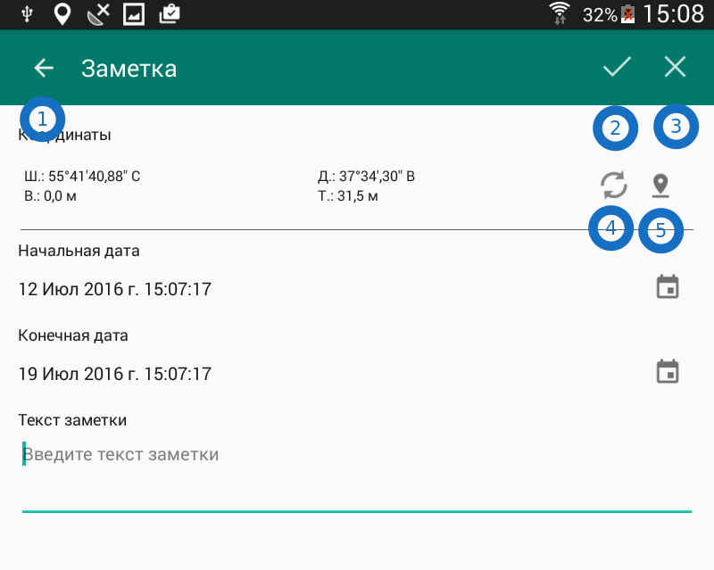

   Окно создания заметки

   1 - отменить создание; 2 - сохранить заметку; 3 - отменить создание; 4 - считать координаты с GPS заново; 5 - указать точку на карте;

Вы можете ввести текст заметки, начальную и конечную дату. По умолчанию, заметка запишется с координатами, которые были в момент открытия формы. Так же можно указать координаты заметки на карте, нажав кнопку 5 (см. :numref:`fw_note_create`). 

Заметки можно просматривать на главной карте приложения, они отображаются точками.

Привязка приложения к пользователю
-----------------------------------------

Приложение привязывается к конкретному сотруднику таким образом: при первом запуске программа спросит имя пользователя и пароль. Создаётся подключение к серверу лесонарушений. 
При необходимости смены пользователя нужно:

#. На главном экране приложения нажать кнопку меню в правом-верхнем углу.
#. В открывшемся меню выбрать Настройки --> Настройки синхронизации.
#. Нажать Редактировать учётную запись либо Удалить учётную запись.
#. Проверить, что бы пункт Автоматическая синхронизация был включён.

