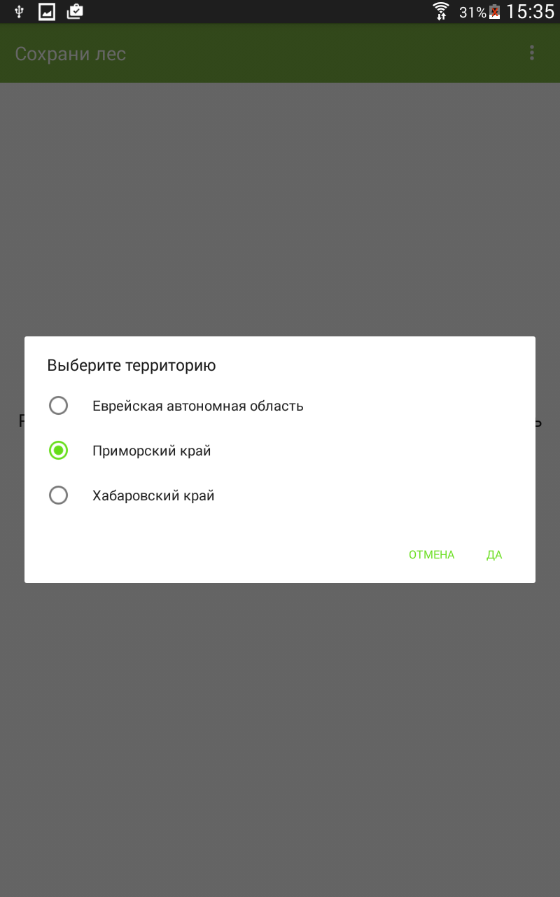
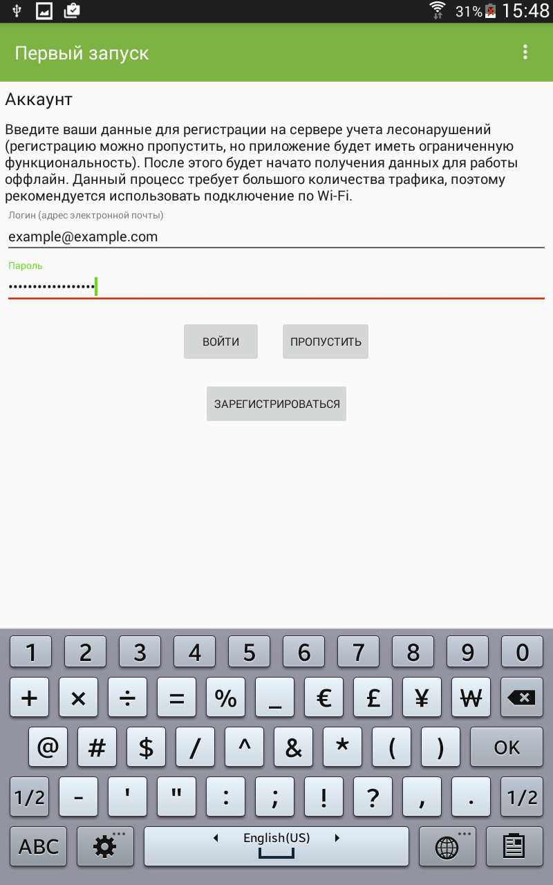
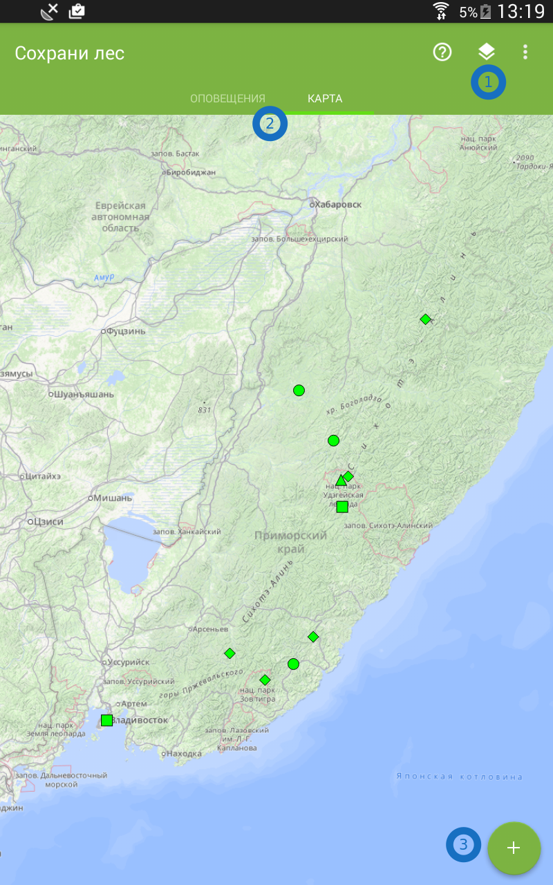
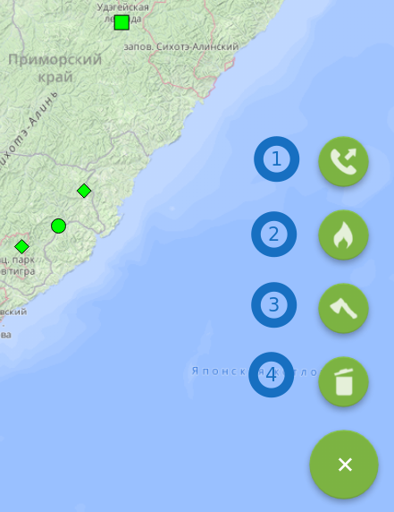
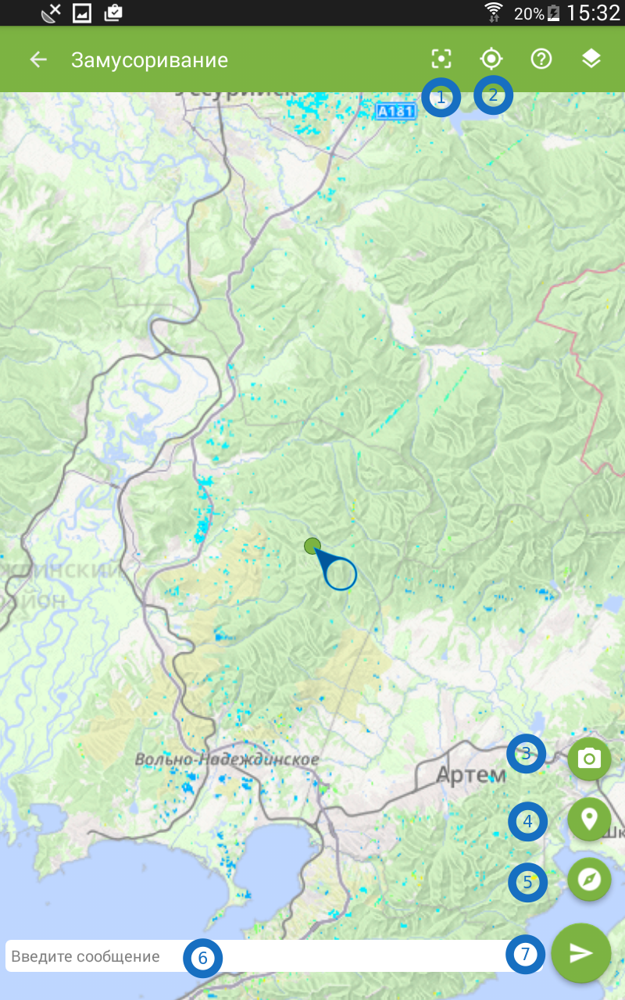
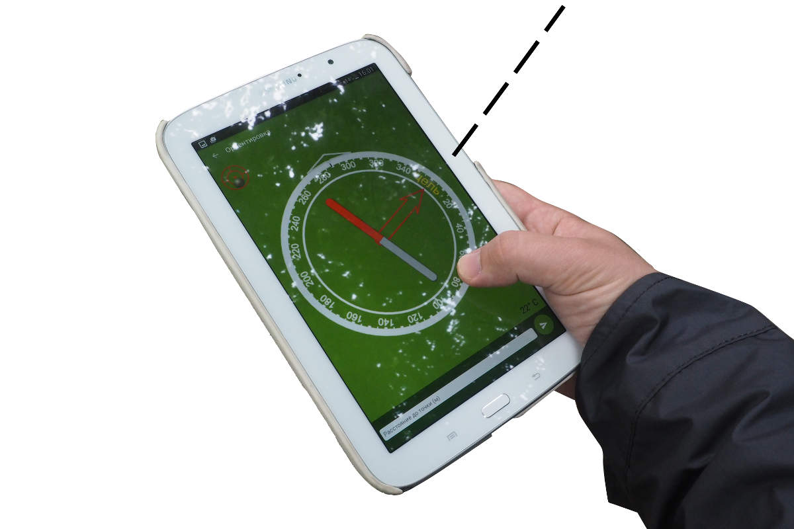
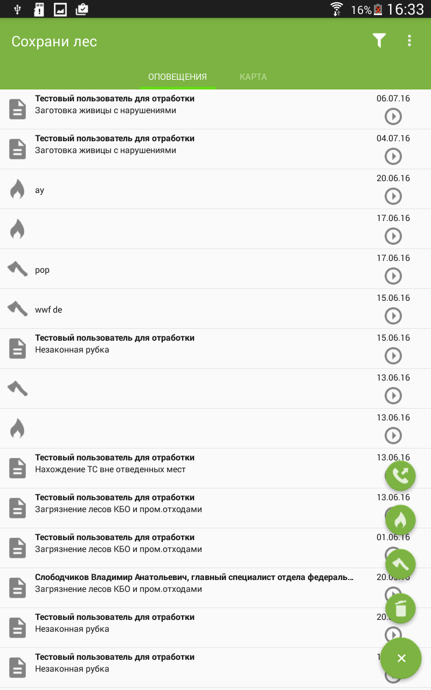

.. sectionauthor:: Дмитрий Барышников <dmitry.baryshnikov@nextgis.ru>

.. _ngfv_user:

Мобильное приложение "Сохрани лес"
==================================

При первом запуске мобильное приложение "Сохрани лес" предложит выбрать регион.

   Окно выбора территории/региона.

Далее, введите ваши данные для регистрации на сервере учета лесонарушений (регистрацию 
можно пропустить, но приложение будет иметь ограниченную функциональность). После этого 
будет начато получения данных для работы оффлайн. Данный процесс требует большого 
количества трафика, поэтому рекомендуется использовать подключение по Wi-Fi.

   Окно регистрации при первом запуске.

Использование
-----------------------------

Главный экран программы представлен картой.

   Главный экран.

   1 - выбор слоёв, 2 - верхняя панель, 3 - кнопка меню основных операций.

Основная задача приложения - создавать заявления.
Нажмите кнопку меню основных операций, и вы сможете выбрать из имеющихся операций:

   Главное меню.

   1 - позвонить диспетчеру по телефону, 2 - заявить о лесном пожаре, 
   3 - заявить о незаконной рубке, 4 - заявить о незаконной свалке.

Когда вы выберите на одну из кнопок из меню основных операций для создания заявления, 
то нужно будет поставить точку на карте. В меню появятся следующие кнопки:

   Создание заявления.

   1 - поставить маркер в центр экрана, 2 - переместить карту в координаты по GPS, 
   3 - сделать фотографию, 4 - переместить карту в координаты по GPS, 
   5 - задать точку по азимуту, 6 - написать текст сообщения, 7 - отправить.

Продвинутые возможности
---------------------------------

Слои на карте
^^^^^^^^^^^^^^^^^^^^^^^^^^^^^^^^^^^^^^^^^^^^^^^^^^^^^^^
Можно выбирать слои, которые будут показываться на карте. Нажмите кнопку 1 на рис. :numref:`sf_mainmap`.

Доступные слои

* Сообщения пользователей - это все сообщения от других пользователей.
* Лесонарушения - автоматически распознаные по космосъёмке точки лесонарушений.
* Пожары - автоматически распознаные по космосъёмке точки пожаров от сервиса fires.kosmosnimki.ru.
* Полигоны инспекторов - территории, которые приписаны к конкретным лесным инспекторам.
* Лесничество - территории лесничеств.
* Landsat - космические снимки с разрешением 15 м/пикс.
* Лесонарушения растр (GeoMixer) - автоматически распознанные точки лесонарушений 
  по спутниковой сьёмке.

Задать точку по азимуту
^^^^^^^^^^^^^^^^^^^^^^^^^^^^^^^^^^^^^^^^^^^^^^^^^^^^^^^

Обычно координаты места для заявления указывается установкой маркера на карте. Если 
до точки вы не можете дойти, и на карте не понятно, где она должна находиться, то 
можно задать её координаты по азимуту и расстоянию. Для этого, при создании заявления 
( см. рис. :numref:`sf_create_issue_map`) нажмите кнопку 5. 

   Задание точки по азимуту.

На экране появится компас. Стоя на месте, поверните круг на экране, так чтобы надпись 
"Цель" указывала на цель. Затем введите в поле внизу предположительное расстояние 
до цели в метрах.  

.. note:: В устройстве должен быть компас.

Список с оповещениями
^^^^^^^^^^^^^^^^^^^^^^^^^^^^^^^^^^^^^^^^^^^^^^^^^^^^^^^

В приложении есть список под названием Оповещения. В списке оповещений перечислены 
все сообщения от других пользователей. При нажатии на кнопку Фильтр можно отобрать 
сообщения пользователей по типам.

   Список оповещений.
